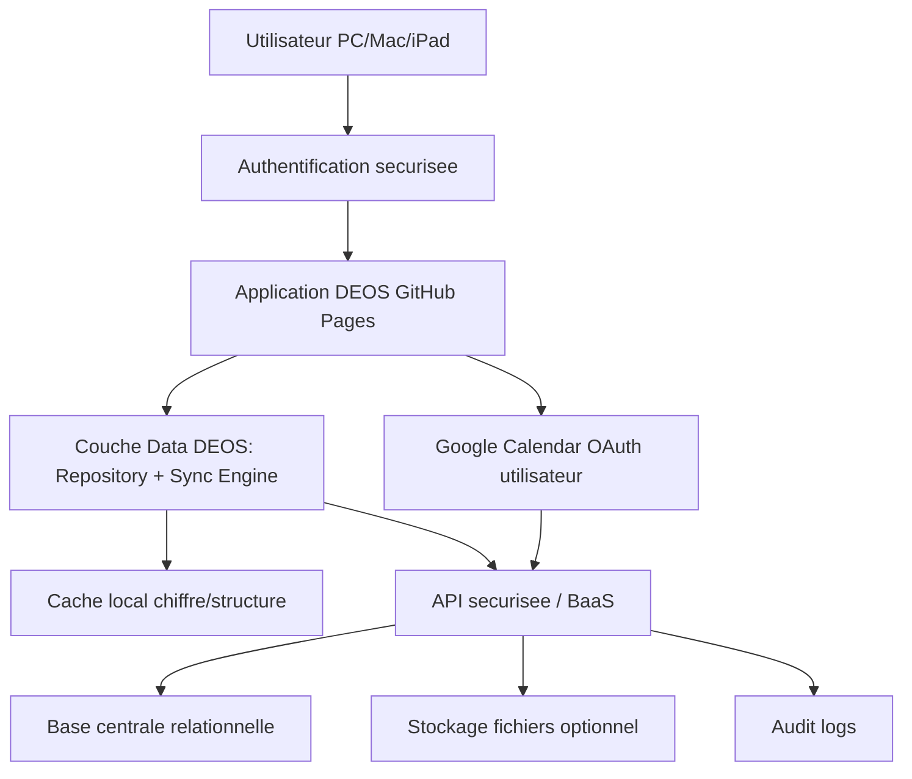

# V5.21A - Audit Architecture Multi-Appareils et Plan de Migration Sécurise

## Diagnostic et recommandation (a lire en premier)

### Diagnostic executeif

Etat constate dans le depot actuel:

- Application 100% front-end statique (HTML/CSS/JS) executee dans le navigateur ([index.html](index.html), [app.js](app.js)).
- Stockage principal local par navigateur via localStorage (cles `deos_*`) et session OAuth via sessionStorage.
- Initialisation: chargement JSON de base, surcharge par localStorage, normalisation en memoire, puis persistance immediate par collection.
- Mode actuel non multi-appareils: chaque navigateur/appareil a son propre localStorage, donc divergence naturelle des donnees.
- Google Calendar connecte cote navigateur (GIS), sans backend serveur, token en sessionStorage local uniquement.
- Sauvegarde/restauration JSON deja presente avec compatibilite legacy, mais orientee poste local.
- Relations metier nombreuses et denses; toute migration doit etre reference-safe et idempotente.

Risque majeur actuel:

- Absence de source de verite distante + ecritures full-collection par cle locale => impossible d'assurer coherence inter-appareils et resolution de conflits.

### Recommandation principale

**Architecture cible recommandee: Scenario A (BaaS relationnel + Auth + RLS) en mode hybride progressif.**

Pourquoi:

- Modele relationnel adapte a DEOS (nombreuses relations croisees: managers/projets/actions/decisions/agenda/documents/performance).
- Securite backend robuste possible (RLS par `workspaceId` + `userId`), indispensable pour multi-entrepots.
- Compatible GitHub Pages (frontend public) sans secret admin cote client.
- Permet une migration par phases controlees avec rollback.
- Favorise auditabilite, controle des conflits et evolution vers plusieurs directeurs/sites.

Compromis:

- Plus de modelisation initiale qu'un NoSQL pur.
- Necessite design soigne de sync offline (queue locale + versioning enregistrement).

Premiere sous-version a developper:

- **V5.21B**: couche d'acces aux donnees (Repository + StorageAdapter + tests de non-regression) sans changement fonctionnel visible.

---

## 1. Resume executif

Objectif V5.21: passer d'un stockage local mono-navigateur a une architecture securisee multi-appareils, avec authentification, synchronisation, gestion de conflits, et conservation des sauvegardes.

Contrainte structurante: conserver un frontend statique public (GitHub Pages) implique qu'aucun secret d'administration ne doit exister dans le code client.

Conclusion: basculer vers une base centrale securisee avec auth et autorisations backend; conserver localStorage en cache/offline transitoire uniquement.

---

## 2. Etat actuel demontre (preuves de code)

### 2.1 Source d'architecture

- Application statique: [index.html](index.html)
  - Charge [app.js](app.js) et scripts front (`gsi/client`, `jszip`, `xlsx`), sans backend applicatif integre.
- Noyau etat metier: [app.js](app.js#L69)
  - `entities = ["actions", "managers", "projects", "decisions", "priorities", "activity", "journal", "documents", "agenda", "folders", "performance", "meetingPreparations", "links", "performance_imports"]`

### 2.2 Chargement / persistance

- Lecture locale: `saved(name, fallback)` ([app.js](app.js#L254))
- Ecriture locale centralisee entites: `persist(name)` ([app.js](app.js#L259))
- Initialisation principale: `init()` ([app.js](app.js#L1010))
  - Charge valeurs JSON `data/*.json` puis surcharge locale et normalise.
  - Persiste chaque collection apres normalisation.

### 2.3 Sauvegarde / restauration

- Construction backup: `buildBackupPayload()` ([app.js](app.js#L393))
- Validation/import legacy map: `validateBackupContent()` + `legacyRootMap` ([app.js](app.js#L480))
- Restauration: `applyBackupPayload()` ([app.js](app.js#L585)), `confirmRestoreBackup()` ([app.js](app.js#L614))

### 2.4 Google Calendar

- Scopes OAuth readonly: [app.js](app.js#L12)
- Token stocke en `sessionStorage` (`deos_gc_token`): [app.js](app.js#L1027), [app.js](app.js#L12997)
- Client ID Google stocke en settings local: [app.js](app.js#L12790), [app.js](app.js#L12990)

---

## 3. Inventaire localStorage/sessionStorage (exhaustif)

## 3.1 Cles localStorage metier et techniques

Cles metier principales (source `entities` + settings/identity/external):

- `deos_actions`
- `deos_managers`
- `deos_projects`
- `deos_decisions`
- `deos_priorities`
- `deos_activity`
- `deos_journal`
- `deos_documents`
- `deos_agenda`
- `deos_folders`
- `deos_performance`
- `deos_meetingPreparations`
- `deos_links`
- `deos_performance_imports`
- `deos_settings`
- `deos_identity`
- `deos_external_events`
- `deos_external_event_enrichments`

Cles techniques backup:

- `deos_backup_last_export`
- `deos_backup_last_restore`
- `deos_backup_category_count`
- `deos_restore_success`

Preuves:

- Ecritures `localStorage.setItem(...)` multiples: [app.js](app.js#L260), [app.js](app.js#L289), [app.js](app.js#L404), [app.js](app.js#L5978), [app.js](app.js#L12824), [app.js](app.js#L13448)
- Cartographie legacy backup: [app.js](app.js#L480)

### 3.2 Cles sessionStorage

- `deos_gc_token` (access token Google)
- `deos_gc_email` (email Google connecte)

Preuves: [app.js](app.js#L1027), [app.js](app.js#L1031), [app.js](app.js#L12997)

### 3.3 Ecritures directes hors `persist(name)`

Ecritures locales non via `persist` generic:

- Identite: `persistIdentity()` -> `deos_identity`.
- Settings: `persistSettings()` -> `deos_settings`.
- Enrichissements Google: `persistExternalEvents()` / `persistExternalEventEnrichmentsOnly()`.
- Metadonnees backup: `deos_backup_*`, `deos_restore_success`.

Conclusion:

- Le depot a deja une centralisation partielle, mais pas une abstraction unique globale de type `dataService` couvrant toutes ecritures.

---

## 4. Initialisation et ordre de migration logique

Pipeline actuel `init()` ([app.js](app.js#L1010)):

1. Charger identite par defaut/fichier et localStorage (`savedIdentity`).
2. Appliquer identite UI (`applyIdentity`).
3. Pour chaque entite:
   - `saved(name, await loadJson(name))`
   - `normalizeCollection(name, ...)`
   - `persist(name)`
4. Charger settings (`ensureSettings(saved("settings", {}))`).
5. Charger donnees externes Google (`external_events`, `external_event_enrichments`).
6. Restaurer session OAuth (`sessionStorage`).
7. Initialiser auto-sync Google si configure.
8. Afficher Cockpit ou Parametres selon `deos_restore_success`.

Observations:

- Le systeme fait une normalisation systematique au demarrage.
- Le localStorage est immediatement reecrit apres normalisation (auto-migration implicite de forme).
- C'est utile pour hygiene locale, mais insuffisant pour sync multi-appareils (pas de version serveur, pas d'ETag, pas de delta queue).

---

## 5. Normalisation, migration implicite et IDs

### 5.1 Normalisation

- Fonction pivot: `normalizeEntity(name, item)` ([app.js](app.js#L900))
- Normalisation collection: `normalizeCollection` ([app.js](app.js#L992))
- Helpers arrays/IDs: `ensureArray`, `normalizeLinkedIdArray`, `normalizeLinkedManagerIds`.

### 5.2 Compatibilite legacy

- Backup legacy root -> cles `deos_*`: `legacyRootMap` ([app.js](app.js#L480))
- Normalisation legacy relations agenda/google (`linkedManagerIds`, `linkedFolders`, etc.).

### 5.3 Identifiants

- Generation locale: `newId(type)` via `Date.now().toString(36)` + `Math.random()` ([app.js](app.js#L735)).
- Comparaison permissive de type: `sameId(a,b)` convertit en string ([app.js](app.js#L810)).

Risque sync:

- IDs globalement uniques probables mais non cryptographiquement garantis.
- Absence de namespace `workspaceId` dans la cle primaire actuelle.
- Idempotence d'import a concevoir explicitement (dedupe par `migrationId` + hash source + upsert par ID).

---

## 6. Cartographie des relations metier (demontree)

Relations explicites identifiees via champs `linked*` et fonctions de graph/liens:

- Manager <-> Action (`linkedActions`)
- Manager <-> Projet (`linkedProjects`, `ownerId`)
- Manager <-> Decision (`linkedDecisions`)
- Manager <-> Dossier (`linkedFolders`)
- Manager <-> Agenda (`linkedManagers` / `linkedManagerIds`)
- Projet <-> Action (`linkedActions`, reciproque via `linkedProjects`)
- Projet <-> Decision (`linkedDecisions`, reciproque via `linkedProjects`)
- Projet <-> Document (`linkedDocuments`, reciproque via `linkedProjects`)
- Projet <-> Dossier (`linkedFolders`)
- Decision <-> Action / Document / Manager / Projet / Dossier
- Document <-> Action / Manager / Projet / Decision / Journal / Performance / Dossier
- Agenda (manuel) <-> Manager/Projet/Action/Decision/Dossier
- Agenda (Google enrichi localement) <-> Manager/Projet/Action/Decision/Dossier
- MeetingPreparation <-> Agenda + liaisons metier derivees
- Performance <-> Manager/Projet/Action/Decision/Journal/Document/Dossier
- Priorite <-> Dossier

Preuves structurelles:

- Normalisation objets: [app.js](app.js#L900)
- Construction graphe relations: [app.js](app.js#L1243) a [app.js](app.js#L1339)
- Helpers liaison agenda/google: [app.js](app.js#L1648)

Points de vigilance migration:

- Coexistence champs legacy `linkedManagers` et `linkedManagerIds`.
- Quelques relations transitives calculees par logique metier (pas seulement par FK explicite).
- Nettoyage de references lors suppressions securisees (dossier/manager/projet), donc importance des contraintes d'integrite en base.

---

## 7. Cartographie complete des donnees

| Objet metier | Cle localStorage | Structure actuelle | Identifiant principal | Liens vers autres objets | Sensibilite | Volume estime | Besoin sync | Strategie migration proposee | Risques particuliers |
|---|---|---|---|---|---|---|---|---|---|
| Parametres (settings) | deos_settings | objet avec `calendarConnection`, `performanceImport` | n/a (singleton) | refs calendrier, mapping import | Restreint | Faible | Eleve | table `settings` par workspace + user overrides | settings Google incoherents inter-appareils |
| Identite application | deos_identity | objet identite UI | n/a (singleton) | aucun direct | Interne | Faible | Moyen | `settings_branding` scope workspace | derive visuelle sans impact metier |
| Managers | deos_managers | array objets manager | `id` | actions/projets/decisions/folders/agenda | Donnee personnelle + managériale sensible | Moyen | Eleve | table `managers` + pivot relations | donnees RH sensibles |
| Dossiers | deos_folders | array dossiers | `id` | managers/projets/actions/decisions/docs/journal/perf | Interne/Restreint | Moyen | Eleve | table `folders` + pivots | suppression cascade a maitriser |
| Projets | deos_projects | array projets | `id` | managers/actions/decisions/documents/folders | Restreint | Moyen | Eleve | table `projects` + pivots | `ownerId` et refs croisées |
| Actions | deos_actions | array actions | `id` | managers/projets/decisions/folders/meetingPreparations | Restreint | Eleve | Eleve | table `actions` + pivots + tombstones | conflits d'edition frequents |
| Decisions | deos_decisions | array decisions | `id` | managers/projets/actions/documents/folders | Donnee managériale sensible | Moyen | Eleve | table `decisions` + versioning strict | contenu sensible, arbitrages |
| Agenda / Reunions manuelles | deos_agenda | array rendez-vous | `id` | managers/projets/actions/decisions/folders | Restreint/Confidentiel | Moyen | Eleve | table `meetings` + `meeting_links` | champs confidentiels |
| Documents | deos_documents | array documents libres + comptes rendus | `id` | managers/projets/actions/decisions/journal/performance/folders | Confidentiel | Moyen/Eleve | Eleve | table `documents` + type + ACL + versions | documents sensibles et historiques |
| Comptes-rendus d'entretien | deos_documents (type/category/reportTemplate) | sous-type document | `id` | idem documents + agenda sourceType/sourceId | Donnee managériale sensible | Moyen | Eleve | sous-table `interview_reports` ou `documents.kind` | conflit contenu narratif |
| Journal operationnel | deos_journal | array entries | `id` | managers/projets/decisions/actions/documents/folders | Confidentiel | Moyen | Eleve | table `journal_entries` | contenu libre potentiellement sensible |
| Liens | deos_links | array liens externes | `id` | indirect | Interne | Faible/Moyen | Moyen | table `links` | URLs potentiellement risquées |
| Performance periods | deos_performance | array structures periodiques riches | `id` | managers/projets/actions/decisions/journal/documents/folders | Restreint | Eleve | Eleve | `performance_periods` + `performance_metrics` + json complementaire | volume et granularity |
| Performance imports | deos_performance_imports | array imports + indicateurs | `id` | vers periods/metriques | Interne/Restreint | Eleve | Eleve | table `performance_imports` + lignes detail | dedupe imports multiple |
| Activity log | deos_activity | array traces UI | `id` | entityId heterogene | Interne | Moyen | Faible/Moyen | `audit_logs` / `activity_feed` | bruit, retention |
| Meeting preparations | deos_meetingPreparations | array prep reunions | `id` + `agendaId` | agenda + liens metier | Restreint | Moyen | Eleve | table `meeting_preparations` + children tables | relation `agendaId` critique |
| Google events importes | deos_external_events | array evenements externes | `_key`/`externalId` | enrichissements locaux | Restreint/Confidentiel | Moyen | Eleve | table `external_calendar_events` par user | token/session per browser |
| Enrichissements Google | deos_external_event_enrichments | objet map par eventKey | `eventKey` | managers/projets/actions/decisions/folders | Confidentiel | Moyen | Eleve | table `external_event_enrichments` | coherence clef dedupe |
| Backup metadata | deos_backup_* | metadonnees techniques | n/a | backup process | Interne | Faible | Faible | table audit backup (optionnelle) | ne pas confondre avec donnees metier |
| Restore flag | deos_restore_success | message transitoire | n/a | UX only | Interne | Tres faible | Faible | peut rester local/transitoire | non metier |

---

## 8. Risques actuels

### 8.1 Risques fonctionnels

- Divergence inter-appareils inevitable (localStorage par navigateur).
- Ecriture full-array par collection: dernier ecriture gagne, sans fusion.
- Pas de gestion native des conflits concurents.

### 8.2 Risques securite

- Frontend public GitHub Pages: tout code JS lisible.
- Impossible de stocker secret admin en securite cote client.
- Donnees sensibles presentes localement en clair dans le navigateur.

### 8.3 Risques integrite donnees

- Relations nombreuses; migration naive peut casser les liens.
- Reimport multiple d'une meme sauvegarde sans idempotence => doublons.
- Suppressions doivent rester logiques/tracees dans un mode distribue.

---

## 9. Google Calendar - diagnostic cible

### 9.1 Ce qui est en place

- OAuth GIS via script public `https://accounts.google.com/gsi/client` ([index.html](index.html)).
- `googleClientId` saisi par l'utilisateur et stocke localement dans settings.
- Token access en `sessionStorage` uniquement (`deos_gc_token`).
- Synchronisation lecture seule des evenements Google vers DEOS.

### 9.2 Pourquoi ca marche sur PC et peut echouer sur iPad

- Le token/session n'est **pas partage** entre appareils (sessionStorage local).
- `googleClientId` et selection calendrier restent locaux (localStorage local).
- Origines OAuth Google peuvent etre incomplètes (domaine GH Pages exact, variantes locales).
- Safari/iPadOS applique des contraintes ITP/popup/cookies qui peuvent perturber la connexion.
- En cas de session expiree, la relance OAuth est necessaire sur chaque appareil.

### 9.3 Adaptation multi-utilisateur future

- Associer connexion Google a `userId` + `workspaceId`.
- Ne jamais stocker de secret OAuth dans le frontend.
- Option recommandee: stockage token/cycle OAuth cote backend (ou provider auth) pour fiabilite multi-device.

---

## 10. GitHub Pages - implications architecturales

Contraintes:

- Site statique: pas de backend natif, pas de secret protege cote serveur sur GitHub Pages.
- JavaScript public: toute cle front est visible.
- Securite reelle doit etre imposee par backend externe (auth + ACL serveur).

Ce qui reste possible:

- App front conservee sur GitHub Pages.
- Connexion a un BaaS/API securise via HTTPS.
- OAuth via provider externe avec origines autorisees.

Points techniques a verrouiller:

- CORS strict sur backend.
- Allowlist origines (prod + preprod + local dev).
- Redirections OAuth compatibles Safari/iPadOS.

---

## 11. Comparaison des architectures (A/B/C)

| Critere | Scenario A - BaaS relationnel | Scenario B - BaaS document | Scenario C - Backend dedie |
|---|---|---|---|
| Compatibilite GitHub Pages | Excellente | Excellente | Excellente |
| Integration app actuelle | Bonne (modelisation FK) | Bonne a moyenne (relations complexes) | Bonne mais plus lourde |
| Securite fine (workspace/user) | Excellente (RLS/politiques) | Bonne (rules docs) | Excellente (custom) |
| Multi-utilisateur | Excellente | Bonne | Excellente |
| Multi-entrepots | Excellente | Bonne | Excellente |
| Offline/cache | A construire (queue) | Souvent natif plus simple | A construire |
| Conflits | Versionnage clair SQL | Souvent doc-level, moins relationnel | Totalement custom |
| Cout previsible | Moyen | Moyen a eleve selon usage temps reel | Variable, souvent plus eleve |
| Complexite dev | Moyenne | Moyenne | Elevee |
| Complexite maintenance | Moyenne | Moyenne | Elevee |
| Compatibilite PC/Mac/iPad | Bonne | Bonne | Bonne |
| Google Calendar integration | Bonne | Bonne | Excellente (controle total) |
| Export/restauration | Bonne | Bonne | Excellente |
| Lock-in fournisseur | Moyen | Moyen/Eleve | Faible/Moyen |
| Limites majeures | modelisation initiale | requetes relationnelles plus difficiles | charge ops/dev importante |

### Conclusion comparative

- **A** est le meilleur compromis pour DEOS (relations metier riches + securite workspace forte + implementation progressive).
- **B** est interessant pour realtime/offline natif, mais moins naturel pour la densite relationnelle DEOS.
- **C** donne le controle maximal, mais surcharge fortement le cout/maintenance pour l'etape actuelle.

---

## 12. Architecture cible recommandee

Schema textuel:

Utilisateur
    -> Authentification
    -> Application DEOS (GitHub Pages)
    -> Couche de synchronisation DEOS (client)
    -> API/BaaS securise
    -> Base centrale (source de verite)
    -> Donnees filtrees par workspaceId/userId cote backend

Principes:

- Base centrale = source de verite.
- Cache local = continuite offline temporaire.
- Controle d'acces 100% backend (jamais JS-only).

---

## 13. Modele multi-utilisateur cible

Champs transverses requis sur objets metier:

- `id` (stable)
- `workspaceId` (ou `organizationId`)
- `siteId` (entrepot)
- `ownerUserId`
- `createdBy`, `updatedBy`
- `createdAt`, `updatedAt`
- `deviceId`/`sessionId` origine
- `recordVersion` (entier) ou `etag`
- `deletedAt`, `deletedBy` (suppression logique)

Roles cibles (a implementer plus tard):

- Proprietaire DEOS
- Administrateur espace
- Directeur d'Entrepot
- Contributeur
- Lecteur

Regle fondamentale:

- Toute lecture/ecriture doit etre contrainte serveur par `workspaceId` + permissions. Un simple changement de requete frontend ne doit jamais exposer un autre espace.

---

## 14. Modele de donnees cible (tables/collections)

### 14.1 Noyau identite

- `users`
- `organizations` (ou `workspaces`)
- `memberships` (role par workspace)
- `sites`

### 14.2 Metier DEOS

- `settings`
- `managers`
- `folders`
- `projects`
- `actions`
- `decisions`
- `meetings`
- `meeting_preparations`
- `documents`
- `interview_reports` (ou `documents.kind = interview_report`)
- `journal_entries`
- `links`
- `priorities`

### 14.3 Performance

- `performance_periods`
- `performance_metrics` (granulaire)
- `performance_imports`
- `performance_import_rows` (optionnel selon granularite choisie)

### 14.4 Externe / sync / audit

- `external_connections`
- `external_calendar_events`
- `external_event_enrichments`
- `sync_metadata`
- `audit_logs`

### 14.5 Politique de structure

- Eviter de stocker chaque categorie en gros JSON monolithique.
- Conserver structure relationnelle pour objets fortement lies.
- Autoriser JSON seulement pour sous-documents fortement encapsules (ex: notes detaillees, payload import brut) avec indexes ciblés.

---

## 15. Strategie de synchronisation

### 15.1 Source de verite

- Post-migration: base centrale prioritaire.
- Local: cache + queue offline.

### 15.2 Offline

- Chargement dernier snapshot connu.
- Journal local des operations (`pending_ops`).
- Etats UI: Hors ligne / Sync en cours / Synchronise / Conflit.
- Reprise automatique au retour reseau.

### 15.3 Conflits

Politique proposee:

- Champs faibles sensibilite: LWW encadre (`updatedAt_server`).
- Objets sensibles (documents/decisions/interviews):
  - controle `recordVersion`
  - detection conflit 409
  - conservation des 2 versions
  - resolution manuelle guidee utilisateur

### 15.4 Suppression

- Suppression logique (`deletedAt`, `deletedBy`).
- Replication de suppression dans queue sync.
- Restauration possible pendant fenetre definie.
- Purge differée cote serveur.

---

## 16. Strategie de migration par phases

### PHASE 0 - Sauvegarde

- Export JSON depuis version en ligne.
- Copie externe horodatee.
- Verification restauration test.

### PHASE 1 - Couche d'acces donnees

- Introduire `dataService/repository/storageAdapter`.
- Le metier n'ecrit plus directement `localStorage.*`.

### PHASE 2 - Mode hybride local + distant

- Lecture locale maintenue.
- Ecriture locale + replication distante.
- Journal de migration et comparateurs.
- Feature flag rollback local-only.

### PHASE 3 - Import initial assiste

- Auth requise.
- Creation workspace/site.
- Apercu compteurs avant import.
- Upsert idempotent par ID + hash backup.
- Aucun effacement local auto.

### PHASE 4 - Source centrale primaire

- Lecture distante prioritaire.
- Cache local derive.
- Sync continue + gestion erreurs.

### PHASE 5 - Validation multi-appareils

- PC, iPad, Mac.
- Verif des liens, documents, agenda, performance.

### PHASE 6 - Depreciation stockage legacy

- Uniquement apres validation complete.
- Conservation sauvegarde historique.
- Aucun purge auto sans confirmation.

---

## 17. Migration des donnees existantes (detail)

### 17.1 Attribution identites

- `userId`: utilisateur connecte qui lance import initial.
- `workspaceId`: espace cree lors onboarding.
- `siteId`: entrepot associe.

### 17.2 Conservation des IDs

- Conserver les `id` historiques actuels comme identifiants metier.
- Ajouter un `sourceSystem = deos_local_v5` + `migrationBatchId`.

### 17.3 Anti-doublons

- Table `migration_runs` avec `backupFingerprint` (hash fichier) + `workspaceId`.
- Blocage second import identique sauf mode force explicite.
- Upsert par `(workspaceId, id)`.

### 17.4 Verification avant/apres

Rapport obligatoire:

- nb managers, dossiers, projets, actions, decisions, rendez-vous, documents, comptes-rendus, journal, metriques performance.
- nb relations resolues.
- nb erreurs.
- nb elements ignores.

### 17.5 Restauration en echec

- Transaction logique par lots.
- Rollback du lot courant + conservation journal erreur.
- Reprise possible depuis checkpoint.

---

## 18. Authentification - modele recommande

Option recommandee usage pro:

- Email + mot de passe **ou** lien magique + MFA optionnelle.
- SSO Google possible en option (pas obligatoire).

Exigences:

- Aucune donnee metier visible sans auth.
- Gestion session (expiration, revoke, logout distant).
- Recuperation compte.
- Rate-limit selon capacites fournisseur.

Ecrans cibles:

- Login
- Creation initiale workspace
- Choix/association site
- Messages d'erreur explicites

---

## 19. Strategie Google Calendar future

Principes:

- Connexion par utilisateur (pas globale navigateur).
- Client ID public ok cote frontend; secret OAuth jamais cote client.
- Scopes minimaux conserves.
- Parametres de connexion lies a `userId/workspaceId`.

Deux modes possibles:

1. OAuth pur frontend + backend stockage metadonnees (minimum viable).
2. OAuth medie backend (recommande entreprise) pour meilleure robustesse multi-appareils/session.

Points Safari/iPad:

- verifier flux popup/consentement,
- verifier origines exactes,
- fallback UX en cas blocage.

---

## 20. Sauvegarde et restauration cible

A conserver meme avec base centrale:

- Export manuel JSON par workspace.
- Inclure: date, version applicative, version format backup, workspaceId, compteurs.
- Apercu avant restauration.
- Restauration non destructive + backup auto pre-restore.

A ajouter cote serveur:

- snapshots periodiques,
- retention configurable,
- restauration objet unitaire,
- restauration complete workspace.

---

## 21. Securite - mesures imperative

Risques identifies:

- Depot public, code JS lisible.
- Donnees sensibles (managers, decisions, documents, journal).
- Import fichiers potentiellement malformes.

Mesures:

- Aucun secret admin dans [app.js](app.js) ni [index.html](index.html).
- ACL backend strictes (`workspaceId`, `userId`, role).
- Validation serveur des payloads (schema + bornes).
- Echappement affichage deja partiellement present via `esc(...)`; a generaliser strictement.
- Journalisation operations sensibles.
- Chiffrement au repos cote backend.
- Politique appareil perdu: revocation sessions + rotation tokens.

---

## 22. Plan de deploiement par sous-versions

### V5.21A - Audit et architecture

- Objectif: diagnostic + plan (ce document)
- Fichiers: `V5.21_ARCHITECTURE_MULTI_APPAREILS.md`
- Risque: mauvaise priorisation
- Test: validation de cadrage
- Critere: accord formel sur architecture cible
- Rollback: n/a

### V5.21B - Couche d'acces donnees locale

- Objectif: abstraction `dataService` sans changer UX
- Fichiers cibles: [app.js](app.js) (refactor interne)
- Risques: regression CRUD
- Tests: non-regression complete + sauvegarde/restauration
- Critere: zero changement fonctionnel visible
- Rollback: revert couche adapter

### V5.21C - Backend test + authentification

- Objectif: auth + workspace test
- Fichiers: frontend auth + config env public
- Risques: blocage acces, CORS
- Tests: login/logout/session expiree
- Critere: acces protege sans fuite
- Rollback: feature flag auth off en preprod

### V5.21D - Mode hybride local+distant

- Objectif: ecriture double + sync queue
- Risques: divergence, duplication
- Tests: offline/online, retries
- Critere: coherence compteurs + liens
- Rollback: local-only flag

### V5.21E - Assistant migration

- Objectif: import idempotent des donnees existantes
- Risques: perte liens/doublons
- Tests: rapport avant/apres + import repete
- Critere: 100% references resolues
- Rollback: restore backup pre-migration

### V5.21F - Validation multi-appareils

- Objectif: PC/iPad/Mac coherence
- Risques: differences navigateur
- Tests: matrice multi-device
- Critere: memes donnees et statuts sync
- Rollback: retour hybride limite

### V5.21G - Google Calendar multi-utilisateur

- Objectif: connexion par user/workspace
- Risques: OAuth safari, tokens
- Tests: consentement, refresh, deconnexion
- Critere: isolation utilisateur complete
- Rollback: desactivation connecteur distant

### V5.21H - Hardening + prod

- Objectif: securite, sauvegarde serveur, observabilite
- Risques: incident prod
- Tests: securite + charge + restauration
- Critere: go-live valide + runbook
- Rollback: freeze ecriture distante + fallback lecture cache

---

## 23. Plan de retour arriere

- Maintenir mode local-only activable par feature flag tant que V5.21F non valide.
- Conserver export JSON pre-migration horodate.
- En cas incident:
  1. bloquer writes distantes,
  2. basculer lecture locale,
  3. restaurer snapshot serveur,
  4. analyser audit logs,
  5. relancer migration incrementale.

---

## 24. Matrice de tests a prevoir

| Test | Objectif | Resultat attendu |
|---|---|---|
| Premiere connexion | valider onboarding | compte cree, workspace associe |
| Mauvaise authentification | securite | erreur claire, pas d'acces donnees |
| Deconnexion | securite session | session invalidee |
| PC puis iPad | multi-device | meme dataset |
| iPad puis Mac | multi-device | meme dataset |
| Creation action | sync CRUD | visible sur autres appareils |
| Modification simultanee | conflits | detection + resolution |
| Document confidentiel | ACL | acces limite aux droits |
| Creation rendez-vous | sync agenda | coherence cross-device |
| Import Performance | volumetrie | import complet, pas de casse |
| Perte reseau | offline | queue locale active |
| Retour reseau | reprise | sync automatique |
| Conflit sur decision | integrite | version mergee/choisie |
| Suppression logique | trace | `deletedAt` sync + restaure possible |
| Restauration | resilience | etat restaure sans perte |
| Export | portabilite | JSON valide + compteurs |
| Migration initiale | fiabilite | compteurs identiques avant/apres |
| Second import meme backup | idempotence | bloque ou no-op controle |
| Changement utilisateur | isolation | aucun acces inter-workspace |
| Tentative acces autre workspace | securite | refus backend |
| Session expiree | UX securite | relogin exige |
| Appareil perdu | securite | revocation session effective |
| Google Calendar Safari | compat | connexion et sync ok |
| Rechargement force | robustesse | etat coherent |
| Nouvelle version GH Pages | regression | donnees conservees |

---

## 25. Decisions a faire valider avant implementation

1. Choix final fournisseur (Scenario A recommande) et niveau de service.
2. Politique roles exacte (droits par role).
3. Niveau de chiffrement et retention des donnees sensibles.
4. Strategie conflit par type d'objet (notamment documents/decisions/interviews).
5. Granularite exacte du modele Performance (ligne metrique vs sous-json).
6. Mode OAuth Google cible (frontend direct vs mediation backend).
7. Politique d'export/restauration serveur + frequence snapshots.
8. Regles de purge soft-delete.
9. Plan de communication utilisateur pendant migration.

---

## RECOMMANDATION PRINCIPALE (synthèse lisible)

- Architecture recommandee: **Scenario A - BaaS relationnel + Auth + politiques backend par workspace/user**.
- Avantages: securite forte, relations metier bien gerees, migration progressive possible, bonne compatibilite multi-appareils.
- Limites: modelisation initiale plus exigeante, effort de sync offline a concevoir.
- Cout/niveau de service: moyen (selon volume, auth, temps reel, stockage).
- Complexite: moyenne a elevee (mais inferieure a backend 100% custom).
- Temps de mise en oeuvre relatif: incrementale en 6-8 sous-versions controlees.
- Risques: conflits de donnees, OAuth Safari, erreurs de mapping migration.
- Premiere sous-version a developper: **V5.21B (couche d'acces aux donnees sans changement fonctionnel)**.

---

## Annexes techniques utiles

### A. Fonctions de stockage/normalisation cle

- `saved` [app.js](app.js#L254)
- `persist` [app.js](app.js#L259)
- `normalizeEntity` [app.js](app.js#L900)
- `normalizeCollection` [app.js](app.js#L992)
- `init` [app.js](app.js#L1010)
- `persistSettings` [app.js](app.js#L12823)
- `persistExternalEvents` [app.js](app.js#L13447)
- `buildBackupPayload` [app.js](app.js#L393)
- `validateBackupContent` [app.js](app.js#L448)

### B. Note de coherence version

- Le code source actuel audite affiche `DEOS_VERSION = "V5.18.3"` en tete de [app.js](app.js#L1), alors que le cadrage projet mentionne V5.20.
- Cette incoherence n'impacte pas directement l'architecture cible, mais doit etre clarifiee avant migration pour tracer correctement les lots (`migrationBatchId`, `appVersionSource`).
